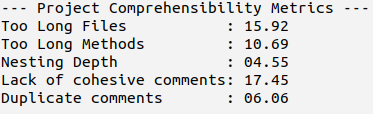
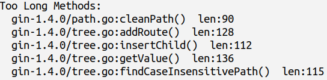

# CompreGo

CompreGo is a tool for calculating comprehensibility of Go projects. Developers can use the tool to measure the comprehensibility of a project and identify which fragments need to be refactored for improving comprehensibility.


## Getting Started

These instructions will get you a copy of the project up and running on your local machine for development or testing purposes.

### Prerequisites

Golang must be installed (>= v1.15.7). To install golang in ubuntu, run-

```
sudo apt-get install golang
```

### Compile the project

At first, download the project and navigate to the source files

```
cd CompreGo/comprego
```

Build the project with

```
go build
```

## Run the Tool

### 1. Find Comprehensibility metrics of a project

CompreGo calculates the following comprehensibility metrics:
* Too Long  Files
* Too Long Methods
* Nesting Depth
* Lack of Cohesive Comments
* Duplicate Comments

To find these metrics, run-

```
./comprego -d project-directory
```

Sample output-



### 2. Add optional arguments to previous command to locate sections that is not comprehensible

* “-TLF”: View list of too long files
* “-TLM”: View list of too long methods
* “-ND”: View list of deeply nested methods
* “-LCC”: View list of non-cohesive comments
* “-DC”: View list of duplicate comments 
* “-ALL”: View details of all the five metrics

For example-

```
./comprego -d project-directory/ -TLM
```

Sample output-




### Set custom thresholds for metrics Calculation

The default thresholds for TLF, TLM and ND are 750, 75 and 5 respectively. However, each project and its maintainers are different and thus thresholds may need to be changed. For this reason, CompreGo has a provision for customizing these thresholds. These thresholds can be changed by adding the following arguments while running the tool:–

* “-lf number”: Set customized threshold for Too Long Files
* “-lm number”: Set customized  threshold  for Too Long Methods
* “-nd number”: Set customized threshold for Nesting Depth 

Where, number represents the customized threshold value.


## License

[MIT](LICENSE.md)
